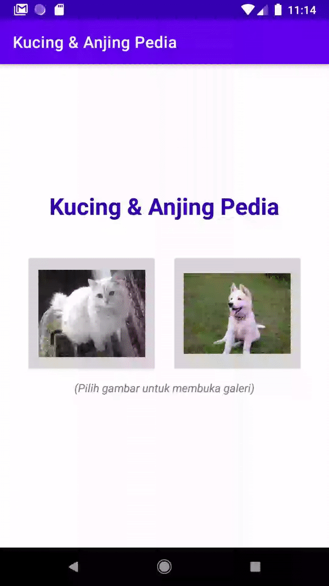

## Kucing & Anjing Pedia | v 2

Contoh aplikasi android sederhana dengan 2 activity yang mendemonstrasikan:
* Cara mengirim informasi dari satu activity ke activity lainnya melalui extra pada Intent, 
* Penggunaan kode yang lebih efisien dari contoh sebelumnya dengan menggunakan inheritance pada model

Merupakan kelanjutan dari contoh sebelumnya di [Kucing & Anjing Pedia](https://github.com/ewinsutriandi/kucing-anjing-pedia)

